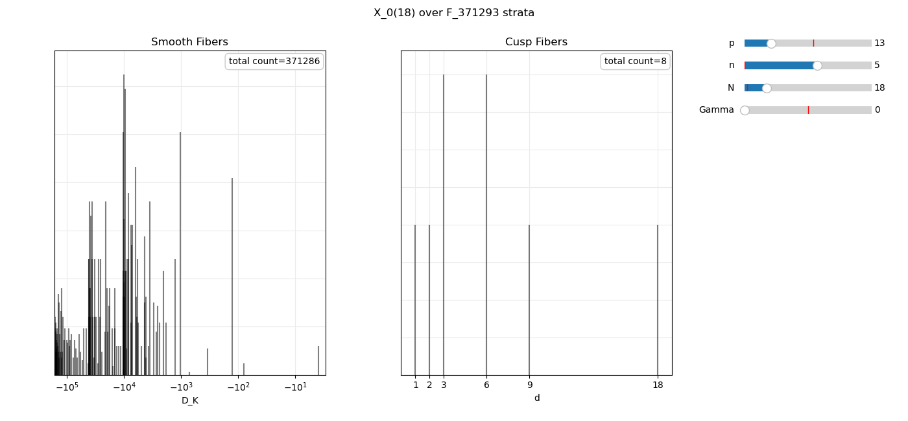
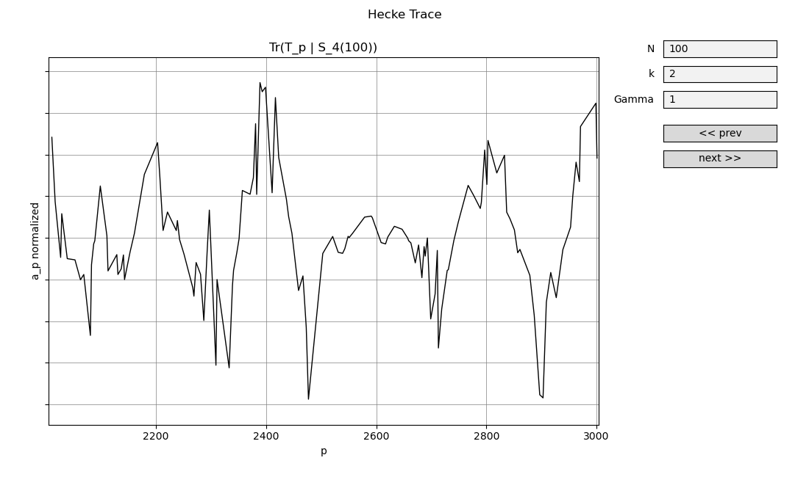

# xn_fq_moduli

Python software for counting points and studying the arithmetic structure of modular curves over finite fields.


## Installation

From the repository root:

```bash
python -m venv .venv
source .venv/bin/activate
python -m pip install -e ".[examples]"
```

The optional PARI support can be installed with:

```bash
python -m pip install -e ".[pari]"
```

PARI significantly speeds up computations for large $q$. The project does not
yet use a cached database for class numbers. After installing the optional
PARI support, pass `--use-pari` to an example:

```bash
python examples/xnfq_count.py --use-pari
```

## Documentation

### Level problems

The level problem is constructed independently of the base field:

```python
from xnfq.moduli import X, X0, X1

X0(N)  # Gamma_0(N)
X1(N)  # Gamma_1(N)
X(N)   # full level Gamma(N)
```

Specialize it to a finite field with:

```python
curve = X1(11).over(p=5, n=1)
```

## Fibers

The modular curve is split into two main fiber types, smooth fibers and cusp
fibers, with each stratum indexed by its Frobenius trace `t`. Over
$\overline{\mathbb F}_q$, smooth fibers are modeled by
$\mathbb Z/N\mathbb Z\times\mathbb Z/N\mathbb Z$, while cusp fibers are
modeled by Neron $d$-gons 
$\mathbb F_q^\times\times\mathbb Z/d\mathbb Z$. The $\mathbb F_q$-rational
fibers are modelled as eigenforms $\pi-\lambda$ acting on the
corresponding group model.

## Count points
```python
curve.count()
```
For a fixed level problem $X_i(N)$, each modular curve point represented by a pair
$(E,\gamma)$ is assigned to the fiber stratum indexed by its Frobenius trace
$t$ and we count the total automorphism weighted contribution per $t$ as

```python
sum = 0
for eigen_form in fiber.eigen_forms:
    model = eigen_form.form
    for level in admissible_levels(fiber, model):
        invariants = compute_invariants(model, level, N)
        stable_lines = count_stable_lines(invariants)
        sum += stable_lines * level_mass(level)

fiber_count = sum * aut_size * gamma_weight(model)
```

Here `gamma_weight` is the scalar determined by the level problem

$$
w_{\Gamma_0}=1,\qquad
w_{\Gamma_1}=\varphi(N),\qquad
w_{\Gamma(N)}=\varphi_{-1}(N),
$$

corresponding to counting lines, points of exact order $N$, or full level
structures, respectively. For full level, the weight is model-dependent.

Example usage

```bash
python examples/xnfq_count.py -N 9 -p 43 -n 2 --type 1
```
Output
```text
X_1(9) fiber count over F_43^2 : #Y_1(9) = 1845, #Cusps_1(9) = 5
```

A simple interactive demo plots smooth contributions by
field $D_K$ and cusp contributions by $d$-strata

```bash
python examples/xnfq_interactive.py -p 13 -n 5 -N 18 --type 0
```



## Structure reports

Beyond point counts, the full fiber structure can be inspected in detail:

```python
curve.get_structure()  # list[SmoothFiberRecordFq | CuspFiberRecordFq]
```

Each record has three levels:

```text
FiberRecordFq
├── kind: smooth | cusp
├── t: Frobenius trace
├── count: final fiber contribution
└── eigen_records
    └── EigenFormRecord
        ├── eigenform
        │   ├── value: lambda
        │   └── form: BinaryQuadraticForm | CuspForm
        └── levels
            └── LevelStructureRecord
                ├── mass: local multiplicity
                ├── inv: rational N-torsion subgroup
                ├── num_lines: number of stable lines
                └── smooth-only
                    ├── scalar: whether pi acts as a scalar
                    ├── coords: coordinates of (pi - lambda) in an
                    │          OK basis
                    └── order: imaginary quadratic order
```

- **Fiber record:** the outer record for one Frobenius stratum. It stores the
    fiber type, the stratum parameter `t`, the total point contribution, and a
    collection of eigenform records.
- **Eigenform record:** one admissible eigenvalue $\lambda$ inside a fiber,
    together with its model. For a smooth fiber, the model is the associated
    binary quadratic form; the integer-trace case has $D_K=0$. For a cusp fiber,
    the model is the cusp form encoding the congruence conditions modulo $N$ on
    the Neron $d$-gon. Each eigenform record contains its level records.
- **Level record:** one local refinement of an eigenform. For a smooth fiber,
    choose a conductor index $f$, embed the shifted form $(1,t,q)-\lambda$ as
    the algebraic integer $\pi-\lambda$ in the corresponding sublattice, and
    record its local invariants. For a cusp fiber, choose an admissible stable
    Neron $d$-gon with group $\mu_{N/d}\times\mathbb Z/d\mathbb Z$ and record
    its local invariants.

### Example: $t=-49$, $D_K=-555$, fiber count $36$

| $f$ | mass | stable lines | invariants |
|---:|---:|---:|:---|
| 1 | 1 | 0 | (3, 3) |
| 3 | 3 | 1 | (1, 9) |

### Example: $t=-58$, $D_K=-7$, fiber count $96$

| $f$ | mass | stable lines | invariants |
|---:|---:|---:|:---|
| 1 | 1 | 0 | (3, 3) |
| 2 | 1 | 0 | (3, 3) |
| 3 | 4 | 1 | (1, 9) |
| 4 | 2 | 0 | (3, 3) |
| 6 | 4 | 1 | (1, 9) |
| 8 | 4 | 0 | (3, 3) |
| 12 | 8 | 1 | (1, 9) |
| 24 | 16 | 1 | (1, 9) |


## Symmetric-power and Hecke traces

The fiber decomposition by trace gives the Frobenius trace on
$\operatorname{Sym}^k$. For cusp forms, this corresponds to Hecke operators
in weight $k+2$.

```python
trace = curve.tr_frob_symk(k)
```

The example includes an optional Sage comparison to verify the result. This
comparison is slow; use small levels, for example $N<20$, and small values of
$q$. For full level (type 2), the comparison currently agrees when
$N\mid q-1$.

```bash
python examples/tr_frob_symk.py -N 11 --type 1 --sage -p 43 --use-pari
```

The interactive Hecke demo plots prime power traces across a range

```bash
python examples/hecke_trace_plot.py -N 100 -k 2 --type 1 -p 2000
```




## TODO

- Add a cached database for class numbers; this is currently the slowest part.
- Add a lattice-structure view.
- Compare $H$ and $\Gamma$ via the $\tau$ embedding, recovering $\tau$ from
    each lattice.
