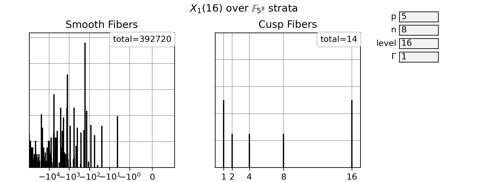

# xn_fq_moduli

Python software for counting points and studying the structure of modular curves over finite fields.

## Contents
- [01. Overview](#01-overview)
- [02. Installation](#02-installation)
- [03. Documentation](#03-documentation)
- [04. Examples](#04-examples)
- [05. TODO](#05-todo--future-work)

## 01. Overview
The main goal of this project is to study $\mathbb F_q$-rational points $(E,\gamma)$ on modular curves, where $E$ is a generalized elliptic curve and $\gamma$ is a level $N$ structure of unspecified type. By sending
```math
(E,\gamma)\;\mapsto\;E\;\mapsto\;(t, i), \qquad t = a_p(E)
```
each point tuple becomes a fiber over $t$ with local index $i$ (determining the level structure) allowing naturally stratification over Frobenius trace $t$ and hence enables efficient computation of traces of modular forms.

The fibers $\gamma$ over a fixed $E$ fall into two primary types — smooth fibers and cusp fibers. Over $\overline{\mathbb F}_q$ smooth fibers are modelled by level structures on $\mathbb Z/N\mathbb Z\times\mathbb Z/N\mathbb Z$, while cusp fibers are modelled via Néron $d$-gons $\mathbb F_q^{\times}\times\mathbb Z/d\mathbb Z$.

The $\mathbb F_q$-rational points in a fiber correspond to Frobenius-stable eigenforms, determined by admissible eigenvalues $\lambda$ depending on the chosen level structure type. For a smooth fiber the eigenform is modelled by the binary quadratic form $(1,t,q)$ shifted by $-\lambda$, giving the algebraic integer $\pi-\lambda$ which satisfies
$N\mid\mathrm{Norm}(\pi-\lambda)$. (When $\pi\in\mathbb Z$ this degenerates to an integral model in $\mathbb Z^2$). Cuspidal fibers are described by congruence conditions on Néron polygons.


## 02. Installation
From the repository root
```bash
python -m pip install -e ".[examples]"
```

### 02.1 Classnumber DB
The library is intentionally built with no required external dependencies. However, class-number computations can be expensive for large ranges (e.g. q &gt; 10^5). We strongly recommend downloading a precomputed class-number database or build locally using PARI if available.

#### 02.1.1 Download
From the repository root
```bash
python scripts/get_classnb_db.py --url "https://github.com/johannatano/xn-fq-moduli/releases/download/classnb-max_d=10.7/classnb.db" --force
```
Saves to `src/xnfq/store/classnb.db`. The library will automatically perform lookups over computation.
#### 02.1.2 Build locally
```bash
python scripts/build_db.py --max-d <N>
```
Pass `--use-pari` to use `pari.qfbclassno(DK)` (requires the `cypari2` package); otherwise the script falls back to library native enumeration of principal reduced forms via `BinaryQuadraticForm.h(DK)` in `xnfq.arithmetic.forms`.

## 03. Documentation
### 3.1 Level Structure
We use a universal model for a generic congruence subgroup which specializes to incremental restrictions following type index
```python
from xnfq.moduli import Gamma0, Gamma1, Gamma2, Gamma
N = 11
# types
Gamma0(N) # shape: upper-triangular, eigenvalues: any
Gamma1(N) # shape: upper-triangular, eigenvalues: [1]
Gamma2(N) # shape: scalar, eigenvalues: [1]

# convenience factory
gamma = Gamma(N, type=1)  # returns Gamma1(N)
gamma = Gamma(N)          # returns Gamma2(N)
```
### 3.2 Modular Curve
The main modular curve object is constructed as a generic moduli problem, further specialized to given finite field
```python
from xnfq.moduli.level_structures import Gamma
from xnfq.moduli.modular_curve import X, X0, X1
N = 13
# general constructor
mod_curve = ModularCurve(Gamma(N, type=1))
mod_curve.over(p=5, n=2) # Set base field

# convenience factory
mod_curve.F(5**2)  # returns mod_curve.over(5, 2)
X0(N) # returns ModularCurve(Gamma(N, type=0)) 
X1(N) # returns ModularCurve(Gamma(N, type=1)) 
X(N) # returns ModularCurve(Gamma(N, type=2))

```
### 3.3 Methods
The library exposes three primary entry points. For lower-level or advanced workflows, most project specific fucntionality can be found in `xnfq.moduli.fq.curve`, `xnfq.moduli.fq.smooth_fibers`, and `xnfq.moduli.fq.cusp_fibers`.
#### 3.3.1 Count
The count method returns the total number of $\mathbb{F}_q$-rational points over each fiber type. 
```python
Y1, Cusp1 = X1(11).F(5**4).count()
```
Both have the following universal structure on the internal strata over $t$
```math
\mathrm{eigen\_count}(t)=\sum_{\lambda}\;\sum_{L\in\mathrm{Levels}(\lambda)}\;\mathrm{num\_lines}(\lambda,L)\cdot\mathrm{mass}(L).
```
local levels are either sublattices indexed by conductor, with torsion invariant $\mathcal L_f/(\pi-\lambda)\mathcal L_f$, or Neron $d$-gon with invariants $\mu_{N/d}\times\mathbb Z/d\mathbb Z$.

The final fiber count of $(E, \gamma)$ over $t$ is then obtained by multiplying the total eigen-count by the global weights
```math
\#\mathrm{fiber}(t)=m_0\cdot\mathrm{eigen\_count}(t)\cdot w_{\Gamma_i}.
```
where $m_0$ is global mass (class-number / automorphism factor) and $w_{\Gamma_i}$ gives the multiplicity of level $N$ structures per Frobenius stabale line as
```math
w_{\Gamma_0}=1,\qquad w_{\Gamma_1}=\varphi(N),\qquad w_{\Gamma(N)}=\varphi_{-1}(N).
```

#### 3.3.2 Generate Structure Report
The fiber strata reveal deeper structure within each eigenform. The full report — including torsion invariants at each local level within the $t$-strata — can be inspected without additional expensive computations.

```python
mod_curve = X1(12).F(5**8)
for fiber in mod_curve.get_structure():
    print(fiber)
```
Each fiber record has the full structure
```text
FiberRecordFq
├── kind: smooth | cusp
├── t: Frobenius trace
├── count: final fiber contribution
└── eigen_records
    └── EigenFormRecord
        ├── eigenform
        │   ├── value: lambda
        │   └── form: BinaryQuadraticForm | CuspForm
        └── levels
            └── LevelStructureRecord
                ├── mass: local multiplicity
                ├── inv: rational N-torsion subgroup
                ├── num_lines: number of stable lines
                └── smooth-only
                    ├── scalar: whether pi acts as a scalar
                    ├── coords: coordinates of (pi - lambda) in an
                    │          OK basis
                    └── order: imaginary quadratic order
```
#### 3.3.2.1 Example : Structure Report
```bash
python examples/xnfq_structure.py -p 13 -n 4 -N 12 --type 0
```
prints a table per eigenform (grouped by $t$ strata)

λ = 5

| f | mass | inv       | stable lines | structure count | level contrib |
|---:|:----:|:----------:|------------:|----------------:|--------------:|
| 1 | 1    | (4, 12)   | 6           | 6               | 24            |
| 2 | 2    | (2, 12)   | 2           | 2               | 16            |
| 4 | 4    | (1, 12)   | 1           | 1               | 16            |

λ = 11

| f | mass | inv       | stable lines | structure count | level contrib |
|---:|:----:|:----------:|------------:|----------------:|--------------:|
| 1 | 1    | (2, 6)    | 0           | 0               | 0             |
| 2 | 2    | (2, 6)    | 0           | 0               | 0             |
| 4 | 4    | (1, 12)   | 1           | 1               | 16            |

#### 3.3.3 Trace
For an instantiated $X_i(N)(\mathbb{F}_q)$, the library compute Frobenius trace on the space of cusp forms of weight $k$ and level $N$ via the formula
```math
\mathrm{tr\_fq}(k)=
-\sum_{t^2 \leq 4q} h_k(t,q,k-2)\cdot\#\mathrm{fiber}(t)
-\sum_{t^2 = 1} t^{k}\cdot\#\mathrm{fiber}(t),
```
```python
trace_rec = X1(12).F(13**3).tr_fq(k)
```
Returs the trace decomposed as
```python
class TrFqTraceRecord:
    val: int
    smooth: int = 0
    cusp: int = 0
    eps0: int = 0
```
where $\varepsilon_0$ is correction term $q+1$ (only for $k-2 = 0$)

#### 3.3.3.1 Example : Basic usage
```bash
python examples/tr_fq.py -p 43 -N 11 -k 2 --type 1
```
#### 3.3.3.2 Example : Prime-range
```bash
python examples/tr_fq.py -p 10000 --range 5 -N 1 -k 12 --type 1 --use-pari
```

Recovering coefficients for the Ramanujan tau function.

| p     | trace                       | smooth                      | cusp |
|:-----:|:---------------------------:|:---------------------------:|:----:|
| 10007 | -5758585642481476962744    | 5758585642481476962743     | 1    |
| 10009 |  2193555277314013067210    | -2193555277314013067211    | 1    |
| 10037 | -16325223441888896359314   | 16325223441888896359313    | 1    |
| 10039 |  16290359320023605948840   | -16290359320023605948841   | 1    |
| 10061 |  -6292973131198206403338   | 6292973131198206403337     | 1    |

Computed 5 traces in 0.286272s

#### 3.3.3.2 Example : Sage verification (primes only)
```bash
python examples/tr_fq.py -p 13 -N 5 -k 2 --sage
```
If `--sage` is given (and Sage is available), `tr_fq.py` will attempt a naive computation of the trace via the full cusp form (only for prime fields `n==1`), and display a comparison of the results per prime. WARNING: The sage method is very slow and is not feasable for $p > 100$ or $N > 20$

## 04. Examples
Common CLI arguments

```bash
-N <int>      # level N
-p <int>      # base prime p
-n <int>      # extension degree n (so q = p**n)
-k <int>      # weight k (integer >= 2)
--type <0|1|2> # Gamma type (0,1,2)
--use-pari     # enable optional PARI acceleration for integer factorization (requires cypari2)
--sage         # run a Sage comparison when supported (trace computations) (requires sage)
--help         # show script-specific options
```

### 04.1 Base
- `examples/xnfq_count.py` — point counts for $q, N$

- `examples/xnfq_structure.py` — detailed structure report over $q, N$

- `examples/tr_fq.py` — compute trace for $q, N, k$

### 04.2 Interactive / plotting
- `examples/xnfq_interactive.py` — Probe the distribution of level structures varying $N$ and extention field, normalized fiber count plots by lattice $D_K$ (smooth) and $d$ (cusps)



- `examples/tr_tp_interactive.py` — Interactive prime-range trace plot, vary weight $k$, level $N$ and step through primes, recovering Hecke traces


## 05. TODO / Future work
- Implement automatic LMBFD API verification instead of Sage
- Probe individual lattice structures $(N, \pi-\lambda)$ to recover isogeny graphs.
- Implement Quaternion Lattice forms (for supersingular graph structure)
- Embed lattice orders $\mathbb{Z} \oplus \mathbb{Z}\tau$ into the full modular curve $\mathbb{H} \setminus \Gamma$.
